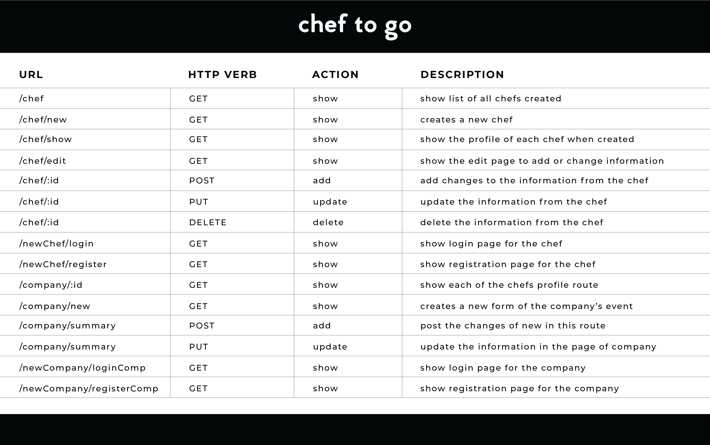

# Chef To Go

**Chef To Go** is a full-stack application that consists on having an easy way to book a freelance chef for corporate parties, meetings and events. In this app, both, the chef and the company can create an account and have full CRUD inside of it.

## Link to Site
...

## Link to Trello (project)
https://trello.com/b/4Q8ACNlA/unit-2-project-chef-to-go

## Technologies used
1. EJS and HTML5
2. CSS
3. JavaScript
4. Node.js
5. Express
6. MongoDB and Mongoose
7. Heroku (for deployment)

## Example Routes

## Prototype Wireframe

## Further Challenges
- To be able to add multiple menus in the chef route, for them to share with the companies.
- Make the user experience easily for the companies join and book a chef.
- Make the edit and delete buttons work on the summary of all the orders.
- Make the payment route work.
- Work in making the design more user friendly.

## MVP User Stories
* As a Chef, I should be able to login to the site, create a profile and update anytime I want to change the menu that the company is going to see.

* As a Company, I should be able to see each of the chefs listed with their information, login to my account to have access for filling a form with special requirements to book a date for chef.

* As both, Chef and Company, we should be able to add/edit/update and delete.
